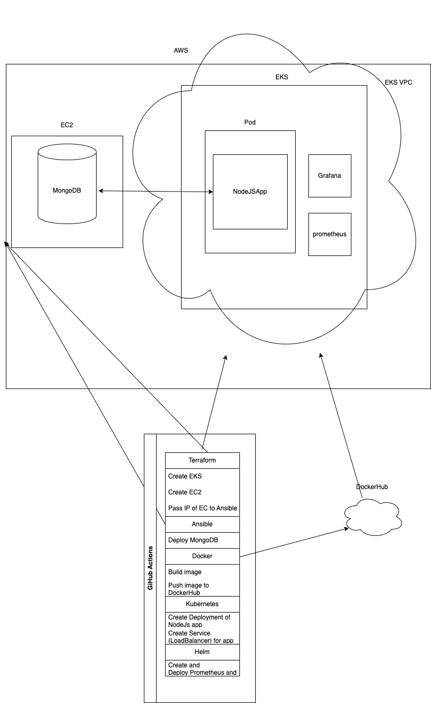

# CI/CD Pipeline with GitHub Actions

This repository contains the necessary configuration to set up a CI/CD pipeline using GitHub Actions. The pipeline is designed to automate the deployment process of an application on an Amazon EKS cluster. It also includes the provisioning of infrastructure using Terraform, deployment of MongoDB using Ansible, Docker image creation and push, Kubernetes deployment of a Node.js app, and the setup of monitoring systems using Prometheus and Grafana through Helm Charts.

## Pipeline Overview

The CI/CD pipeline consists of several stages, each responsible for a specific task in the deployment process. Below is an overview of the stages:

### Stage 1: Infrastructure Provisioning with Terraform

In this stage, the pipeline uses Terraform to create the required infrastructure on AWS. It sets up a Virtual Private Cloud (VPC) for the Amazon EKS cluster, creates the EKS cluster itself, and provisions an EC2 instance for deploying MongoDB. The EC2 instance's IP address is passed to Ansible using `local_file` in Terraform, eliminating the need for manual copying and pasting.

Terraform files are located in the `terraform` folder.

### Stage 2: MongoDB Deployment with Ansible

In this stage, Ansible is used to deploy MongoDB on the provisioned EC2 instance. The EC2 instance's IP address, obtained from the previous stage, is used as an input to Ansible for seamless deployment.

Ansible files are located in the `ansible` folder.

### Stage 3: Docker Image Build and Push

This stage involves building a Docker image for the Node.js application located in the `nodeJSApp` folder. The built image is then pushed to Docker Hub for use in the subsequent Kubernetes deployment.

### Stage 4: Kubernetes Deployment of Node.js App

In this stage, the pipeline deploys the Node.js application to the Amazon EKS cluster. The application is deployed as a Kubernetes deployment and exposed using a LoadBalancer service.

Kubernetes configuration files are located in the `kubernetes` folder.

### Stage 5: Monitoring System Setup with Helm Charts

The final stage focuses on setting up monitoring systems, specifically Prometheus and Grafana, using Helm Charts. These tools are deployed onto the Kubernetes cluster to monitor its health and performance.

Helm Chart configuration files are located in the `kubernetes` folder as well.

## Architecture

## Getting Started

To use this CI/CD pipeline for your own project, follow these steps:

1. **Clone the Repository**: Clone this repository to your local environment.

2. **Configure Secrets**: Set up the necessary secrets in your GitHub repository settings. These could include AWS credentials, Docker Hub credentials, and any other required tokens.

3. **Modify Configurations**: Update the necessary configuration files to match your project requirements. This includes Terraform variables, Ansible playbooks, Dockerfiles, Kubernetes deployment configurations, and Helm Chart values.

4. **Push Changes**: Commit and push your changes to the repository.

5. **GitHub Actions**: The configured GitHub Actions workflows (found in the `.github/workflows` folder) is triggered manuall whenever needs to be pushed to the repository. The pipeline will run through the defined stages, automating the deployment process.

## Notes

- Make sure you have the required permissions and credentials set up for the services you are using (AWS, Docker Hub, etc.).
- It's recommended to review and customize the pipeline stages and configurations according to your specific project needs.
- This README provides an overview of the pipeline. More detailed instructions can be found within individual folders and configuration files.

Feel free to reach out if you have any questions or need further assistance!
